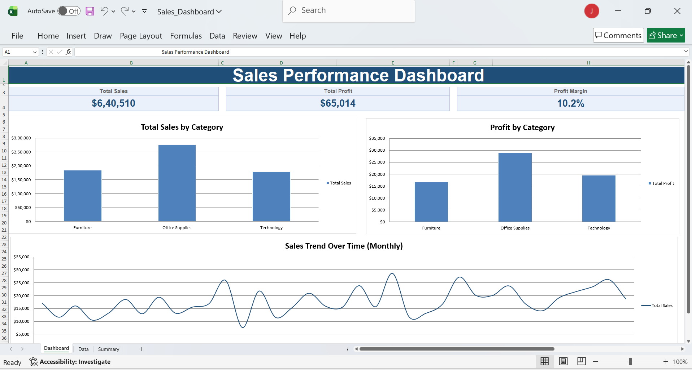

# Excel Sales Dashboard

**Skill Craft Technology — Task 01**

An interactive sales performance dashboard built in Microsoft Excel using pivot-style summary tables, charts, and conditional formatting.

## Objective
Clean and analyze a Superstore-style sales dataset to visualize:
- Total Sales and Profit by Category
- Sales Trends over time
- High/low performers via Conditional Formatting

## Dashboard Preview

## Workbook Structure
- **Dashboard** — KPI cards (Total Sales, Total Profit, Profit Margin) and 3 charts:
  - Total Sales by Category (bar chart)
  - Profit by Category (bar chart)
  - Sales Trend Over Time (smoothed line chart, monthly)
- **Data** — Raw sales data as an Excel Table (`SalesData`) with color-scale conditional formatting on Sales and Profit, and red highlighting for loss-making (negative profit) rows
- **Summary** — Pivot-style summary tables (Category-wise Sales/Profit/Margin and Monthly Sales Trend), built with `SUMIF`/`SUMPRODUCT` formulas so the dashboard updates automatically when data changes

## Tools Used
- Microsoft Excel (Tables, Pivot-style formulas, Charts, Conditional Formatting)

## Key Insights
- Technology category leads in both Total Sales and Profit
- Sales show strong monthly fluctuation with an overall upward trend
- Conditional formatting quickly flags loss-making transactions for review

## How to Use
1. Download `Sales_Dashboard.xlsx`
2. Replace data in the **Data** sheet (keep the same column headers)
3. The Summary tables and Dashboard charts/KPIs update automatically
